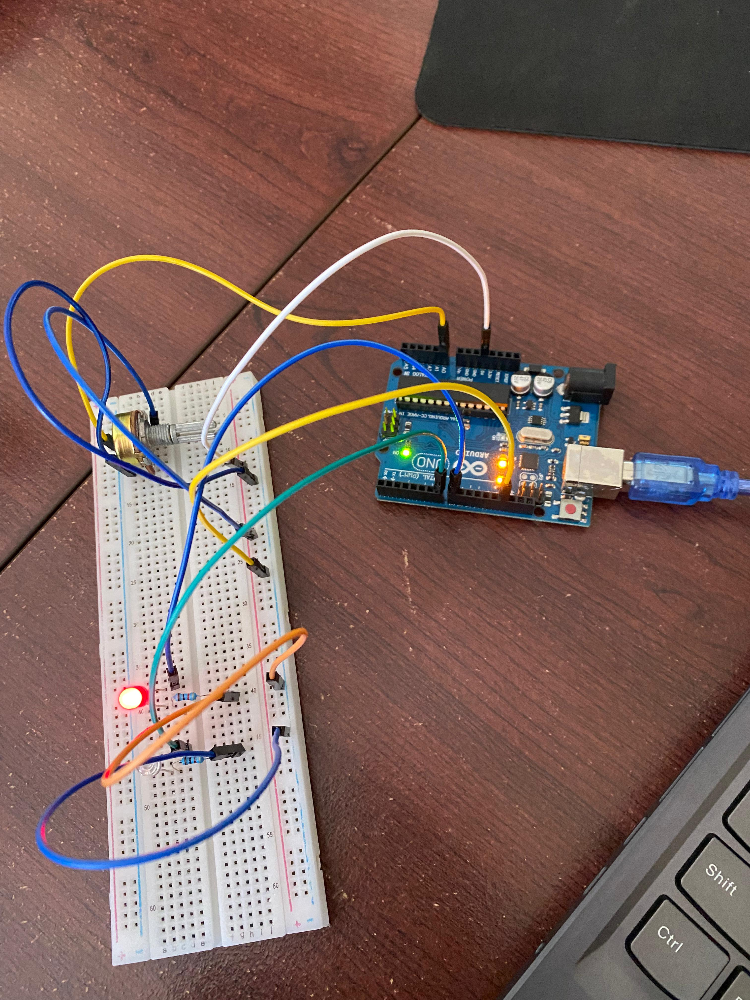

# Dokumentasi Praktikum: Kendali LED dengan LDR dan Potensiometer

## Komponen
1. Arduino Uno R3: Berperan sebagai unit pemroses utama untuk membaca input dari sensor analog (LDR dan Potensiometer) serta memberikan perintah output ke LED.
2. Potensiometer (Analog Input 1): Digunakan sebagai input variabel manual untuk mengatur parameter tertentu, seperti batas ambang (threshold) cahaya atau intensitas LED.
3. LDR - Light Dependent Resistor (Analog Input 2): Sensor yang mendeteksi tingkat cahaya di sekitar lingkungan praktikum.
4. LED Merah (Output): Komponen output yang menyala sebagai indikator atau aktuator berdasarkan data dari sensor.
5. Resistor: Digunakan untuk membatasi arus yang masuk ke LED agar tidak terbakar dan sebagai bagian dari rangkaian pembagi tegangan (voltage divider) untuk LDR.
6. Breadboard & Jumper Wires: Digunakan sebagai media untuk menyusun rangkaian tanpa penyolderan serta mendistribusikan jalur daya dan sinyal.

## Penjelasan Dokumentasi
1. Input Analog: Kabel jumper menghubungkan pin tengah potensiometer dan rangkaian LDR ke pin Analog (seperti A0 dan A1) pada Arduino untuk membaca nilai tegangan yang berubah.
2. Output Digital/PWM: LED terhubung ke pin digital (terlihat di area pin 9-13) melalui resistor untuk menerima sinyal aktif/non-aktif atau sinyal PWM untuk pengaturan kecerahan.
3. Sistem Daya: Rangkaian menggunakan jalur daya terpusat pada rail breadboard yang dihubungkan ke pin 5V dan GND (Ground) pada Arduino Uno.
4. Konektivitas: Arduino terhubung ke komputer melalui kabel USB tipe B untuk proses pengunggahan kode (sketch) dan sumber daya listrik primer.