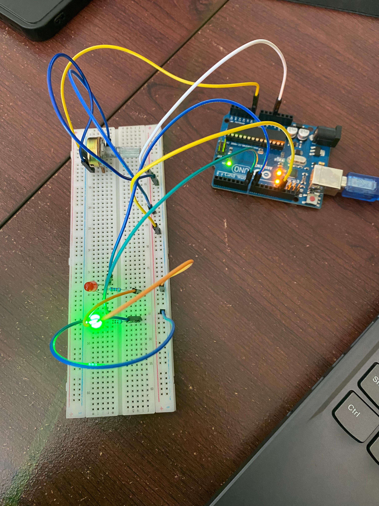

# Dokumentasi Praktikum 5A (Modifikasi)

## Komponen
1. Arduino Uno R3: Sebagai otak utama yang mengolah data dari sensor analog dan mengontrol nyala LED.
2. Potensiometer (Input Analog 1): Digunakan untuk memodifikasi nilai ambang batas (threshold) atau mengatur intensitas secara manual melalui pin analog.
3. LDR - Light Dependent Resistor (Input Analog 2): Sensor cahaya yang memberikan input otomatis berdasarkan kondisi pencahayaan lingkungan.
4. Dual LED (Output):
   - LED Hijau: Menyala sebagai indikator kondisi tertentu (misal: cahaya cukup atau nilai di atas threshold).
   - LED Merah: Sebagai indikator kondisi sebaliknya (misal: cahaya gelap atau nilai di bawah threshold).
5. Resistor: Digunakan sebagai pembatas arus untuk LED dan sebagai bagian dari rangkaian pembagi tegangan pada LDR.
6. Breadboard & Jumper Wires: Media penghubung antar komponen dan pendistribusian daya 5V serta GND.

## Penjelasan Dokumentasi
1. Kontrol Manual & Otomatis: Proyek ini menggabungkan input otomatis (LDR) dengan kontrol manual (Potensiometer) untuk menentukan kapan LED harus beralih dari Merah ke Hijau.
2. Pembacaan Analog: Arduino membaca nilai dari Potensiometer dan LDR secara bergantian melalui pin A0 dan A1.
3. Logika Output: Program menggunakan logika perbandingan; jika nilai sensor melewati batas yang ditentukan potensiometer, maka LED Hijau akan aktif (seperti terlihat pada gambar), dan jika tidak, LED Merah yang aktif.
4. Wiring: Seluruh komponen terhubung ke jalur daya yang sama pada rail breadboard untuk memastikan stabilitas suplai tegangan.