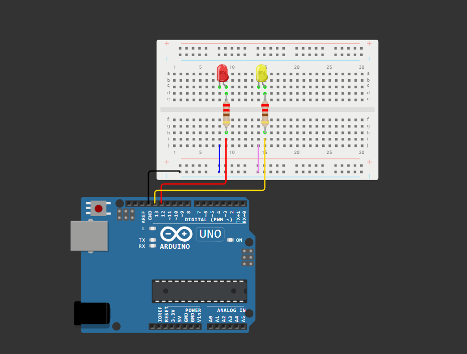

# Dokumentasi Praktikum 5B

## Komponen

1. Arduino Uno R3: Berperan sebagai unit pemroses utama untuk menjalankan RTOS (Real-Time Operating System), melakukan penjadwalan task, serta mengontrol antrean data (queue).
2. LED Merah (Indikator Visual 1): Berperan sebagai indikator visual eksternal yang diaktifkan oleh Task pengirim data (read_data) melalui pin digital 12 saat proses pengiriman data berlangsung.
3. LED Kuning (Indikator Visual 2): Berperan sebagai indikator visual eksternal yang diaktifkan oleh Task penerima data (display) melalui pin digital 13 saat berhasil mengambil data dari antrean.
4. Resistor 220 Ohm: Berperan sebagai komponen pembatas arus listrik guna melindungi kedua LED agar tidak kelebihan beban tegangan.
5. Breadboard & Jumper Wires: Jalur distribusi daya (VCC dan GND) serta penghubung sinyal kontrol antara pin Arduino dengan komponen LED.

## Penjelasan Dokumentasi

1. Sistem Multitasking (FreeRTOS): Dua buah fungsi kerja (task) mandiri dibuat menggunakan fungsi xTaskCreate() agar dapat berjalan secara concurrent (bersamaan) di bawah kendali scheduler FreeRTOS.
2. Komunikasi Antar Task (Queue): Task pertama (read_data) mengemas data tiruan sensor ke dalam format structure lalu mengirimkannya ke media penyimpanan antrean (queue). Task kedua (display) secara independen memantau antrean tersebut untuk mengambil data secara berkala.
3. Output Indikator (Hardware): Kaki positif (anoda) LED Merah terhubung ke pin digital 12 dan LED Kuning terhubung ke pin digital 13 untuk memberikan respon visual nyata yang sinkron dengan aktivitas komunikasi data internal sistem.
4. Output Monitor (Software): Setiap data yang berhasil diterima oleh Task kedua akan didekode kembali dan langsung dicetak menuju Serial Monitor dengan format penampilan nilai suhu (temp) dan kelembapan (humidity).
5. Power: Seluruh komponen LED pada rangkaian mendapatkan suplai daya utama serta referensi pembumian (GND) yang stabil langsung dari pinout papan Arduino Uno melalui jalur distribusi rail breadboard.