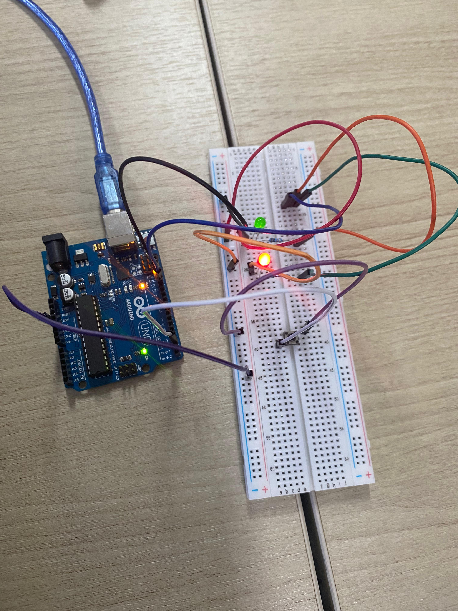

# Dokumentasi Praktikum: External Interrup

## Komponen
1. **Arduino Uno R3:** Berperan sebagai unit pemroses utama untuk membaca sinyal input digital dari pushbutton serta memberikan perintah output digital ke LED Merah dan LED Hijau.
2. **Pushbutton / Saklar Tekan (Digital Input):** Digunakan sebagai sakelar input digital untuk memberikan sinyal logika (HIGH/LOW atau ON/OFF) ke Arduino guna mengendalikan status menyala dari kedua LED.
3. **LED Merah (Digital Output):** Komponen output sebagai indikator pertama yang dikendalikan oleh pin digital Arduino (terlihat dalam kondisi aktif/menyala pada foto).
4. **LED Hijau (Digital Output):** Komponen output sebagai indikator kedua yang dikendalikan oleh pin digital Arduino untuk menunjukkan status atau mode alternatif.
5. **Resistor:** Digunakan sebagai pembatas arus (current limiter) yang dipasang seri dengan LED Merah dan LED Hijau agar komponen tidak terbakar akibat menerima arus berlebih.
6. **Breadboard & Jumper Wires:** Digunakan sebagai media untuk menyusun rangkaian komponen secara sementara tanpa penyolderan serta mendistribusikan jalur sinyal dan daya dari Arduino.

## Penjelasan Dokumentasi
1. **Input Digital (Pushbutton):** Kabel jumper (warna ungu) menghubungkan kaki kaki pushbutton ke salah satu pin digital input Arduino (seperti Pin 2) untuk membaca perubahan logika ketika tombol ditekan maupun dilepas.
2. **Output Digital (Dual LED):** LED Merah dan LED Hijau masing-masing terhubung ke pin digital Arduino melalui resistor pembatas arus untuk menerima sinyal kontrol guna menyalakan atau mematikan LED secara bergantian atau bersamaan.
3. **Sistem Grounding & Daya:** Rangkaian menggunakan pin GND (Ground) pada Arduino yang didistribusikan melalui kabel jumper ke kaki katoda LED dan kaki pushbutton untuk menutup sirkuit aliran arus listrik.
4. **Konektivitas:** Arduino Uno terhubung ke perangkat komputer menggunakan kabel USB tipe B berwarna biru yang berfungsi sebagai media catu daya (power supply) primer sekaligus jalur komunikasi data untuk mengunggah kode program (*sketch*).