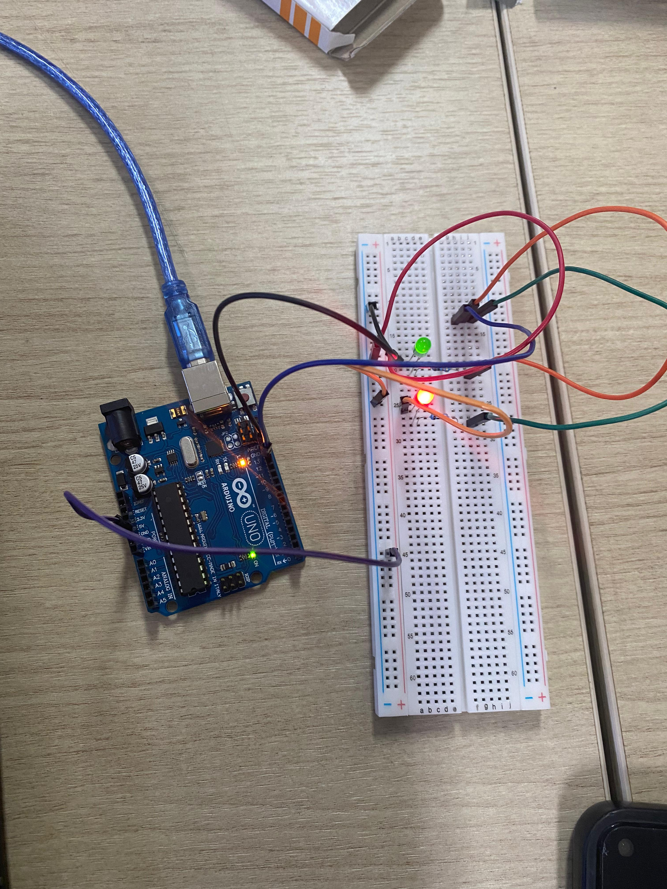

# Dokumentasi Praktikum: Timer Menggunakan millis()

## Komponen
1. **Arduino Uno R3:** Berperan sebagai unit pemroses utama yang mengeksekusi kode program untuk mengendalikan kondisi aktif/non-aktif kedua LED secara otomatis (seperti visualisasi *flip-flop*) atau menerima instruksi karakter melalui Serial Monitor.
2. **LED Merah (Digital Output):** Komponen output utama sebagai indikator pertama yang dikendalikan oleh pin digital Arduino (terlihat dalam kondisi aktif/menyala pada foto).
3. **LED Hijau (Digital Output):** Komponen output sebagai indikator kedua yang dikendalikan oleh pin digital Arduino untuk menunjukkan status transisi atau kondisi logika alternatif.
4. **Resistor:** Digunakan sebagai pembatas arus (*current limiter*) yang terhubung seri dengan masing-masing LED untuk menjaga agar arus listrik yang mengalir tidak melebihi kapasitas maksimum komponen.
5. **Breadboard & Jumper Wires:** Digunakan sebagai media pencabangan jalur distribusi daya (GND) serta penghubung sinyal kontrol dari pin digital Arduino menuju rangkaian LED tanpa memerlukan proses penyolderan.

## Penjelasan Dokumentasi
1. **Output Digital (Dual LED):** LED Merah dan LED Hijau terhubung ke pin digital output Arduino melalui resistor pembatas arus, memungkinkan kontrol penuh terhadap pola nyala (sekuensial, berkedip, atau bergantian).
2. **Peniadaan Input Fisik (Tanpa Pushbutton):** Berbeda dengan Percobaan 6A, komponen sakelar mekanis (*pushbutton*) telah dilepas dari *breadboard*. Kendali sistem dialihkan sepenuhnya secara otomatis berbasis waktu (*delay*) di dalam program (*sketch*) atau menggunakan input data melalui komunikasi serial dari komputer.
3. **Sistem Grounding & Daya:** Jalur katoda dari kedua LED terhubung ke *rail* negatif (GND) pada *breadboard*, yang kemudian dihubungkan kembali ke pin GND Arduino menggunakan kabel jumper untuk membentuk rangkaian arus searah yang tertutup.
4. **Konektivitas & Catuan:** Papan Arduino Uno mendapatkan suplai tegangan operasi sekaligus jalur komunikasi data melalui kabel USB tipe B berwarna biru yang terhubung ke komputer, memfasilitasi pemantauan data secara *real-time* via Serial Monitor.